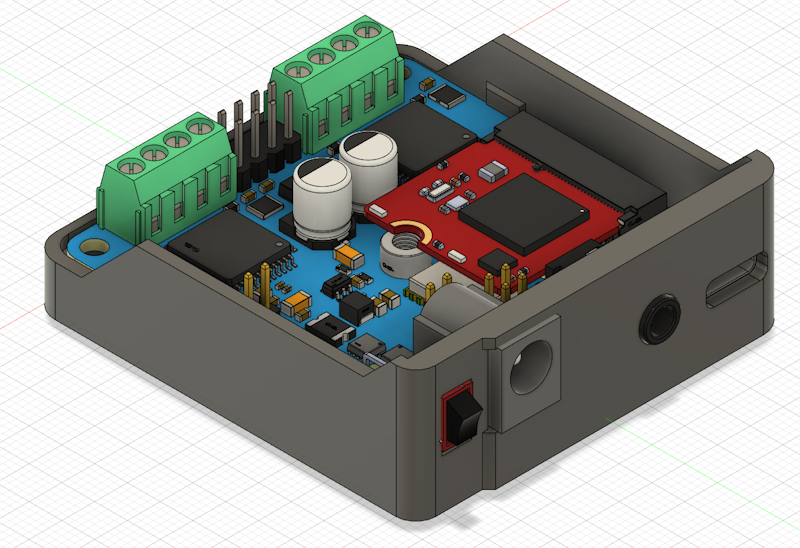
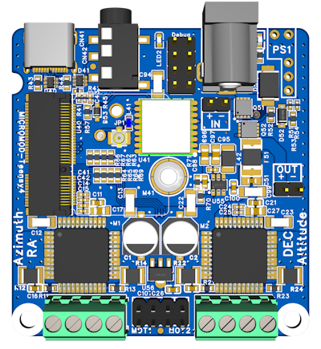
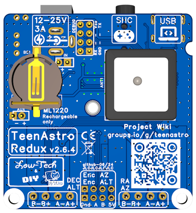
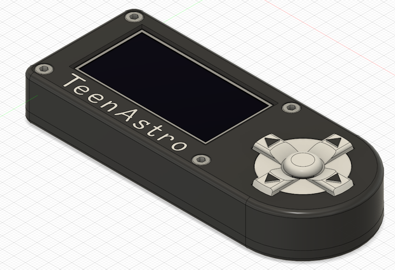
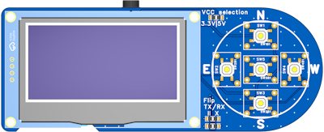
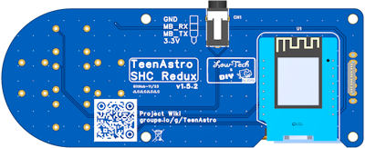

# Unicorn - Mount Control Station

# ⚠Work in Progress -NOT VALIDATED- don't build it⚠

### A small but efficient controller board for astronomic mount, featuring TeenAstro Redux
 Visit the main WiKi project on [groups.io](https://groups.io/g/TeenAstro/wiki)
 
 Firmware is available on the [project GitHub](https://github.com/charleslemaire0/TeenAstro) (support in progress)
 
 
 

## Project details
Source project can be found on [OSHWLab](https://oshwlab.com/lordzurp/teenastro-redux)

### Main Board : TeenAstro Redux

#### Specs

* 56x54mm form factor, 60x58x20 3D printed case
* 12 to 25V power input, 3A max
* Power protection (rearmable fuse + wrong polarity)
* ESD protection on USB and SHC port
* USB-C connector
* Teensy 4.0 Micromod
* TMC2660 stepper drivers
* Integrated GNSS
* encoders support
* no ST4 port

#### PCB views
 

### Smart Hand Controller (SHC)

#### Specs

* 125x50x20mm 3D printed case
* ESP8266 (Wemos D1 mini)
* 2.42" OLED display
* tactiles switchs with D-pad style buttons
* selectable 3.3V or 5V power input
* headphone 3.5mm 4pins link
* no focuser control (planed later)

#### PCB view
 

## Build Instructions

### The fancy way : JLCpcb Prototyping service

Open the OSHWlab project on editor, click to "Order PCB", wait a week or two and enjoy !

The BOM is tuned to minimise assembly costs, so some thru-holes components are disabled from factory's assembling, you need to order them and sold by your own. The good news is you can customize the connectors or re-use your own components stock ;)

The TH parts are listed into the BOM file, with "add to BOM" option set to "No"

### The hard way : Do It All Yourself

all necessary files are available, with complete BOM, gerbers files and Pick_n_Place. Choose your PCB manufacturer, order the parts by yourself and grow up your soldering skill with a complete by-hand board. Be aware there are very small components or pitch, manual assembling should be reserved to advanced and skilled users

