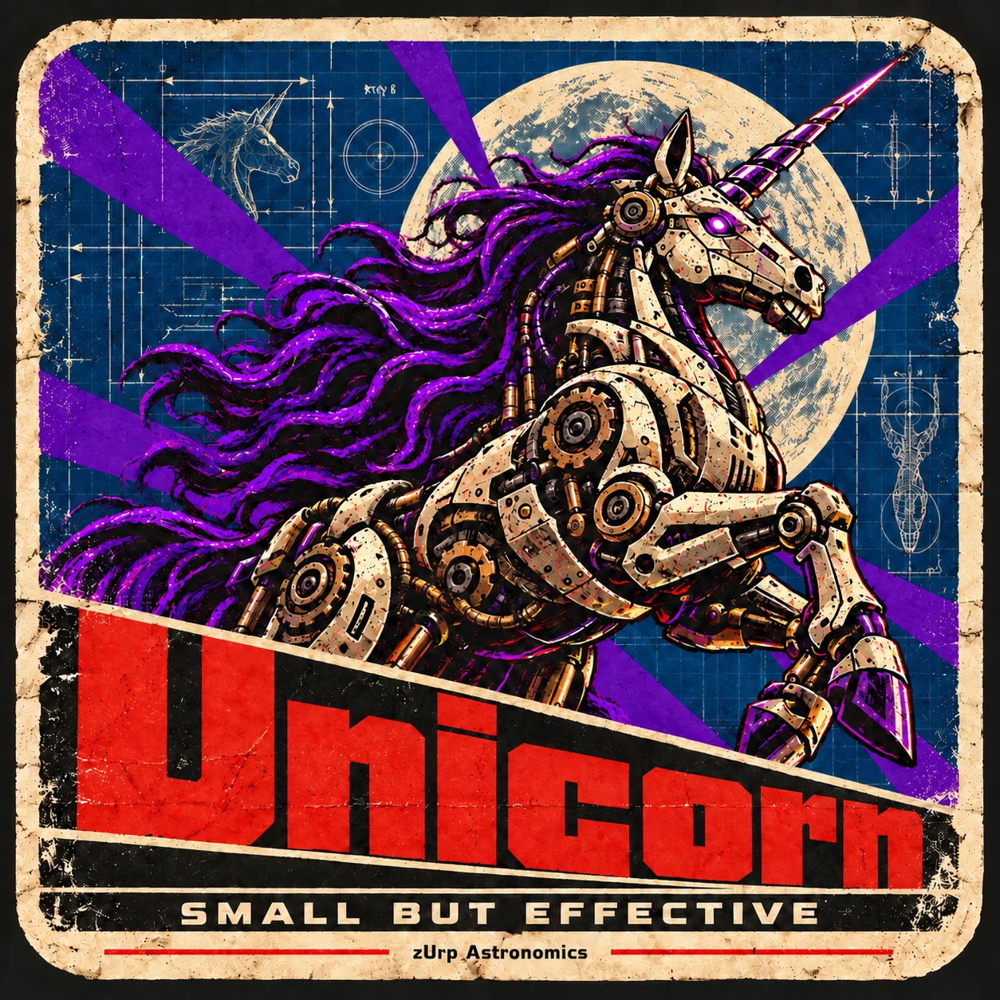
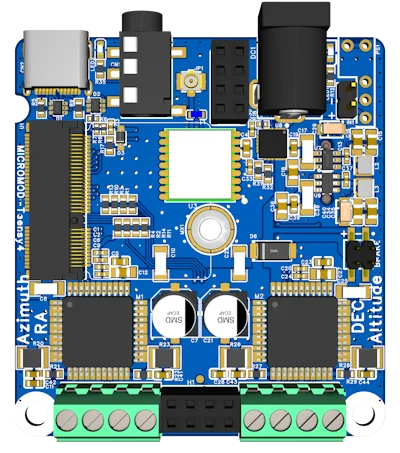
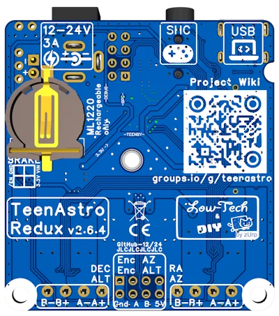
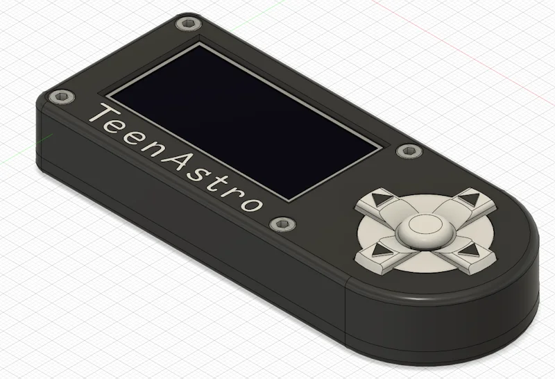
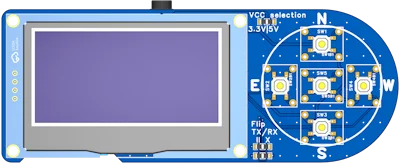
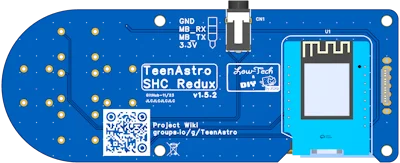
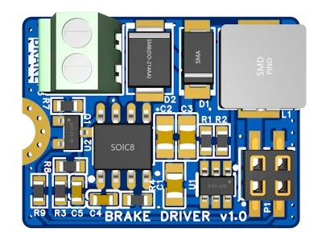
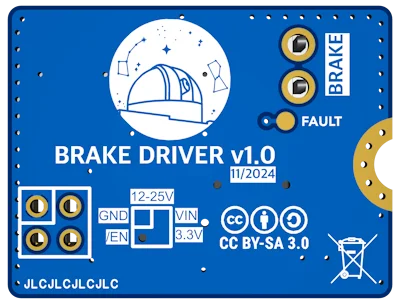

<!-- zurp-readme-header:begin — paste this block once, never again: the poster and the badges update themselves at each build of the site — do not edit it -->

<!-- zurp-readme-header:end -->

<h1 align="center">Unicorn</h1>

<strong><em>Small but effective</em></strong>

  <a href="https://zurp-astronomics.github.io/unicorn/">Website</a> ·
  <a href="../../releases">Releases</a> ·
  <a href="https://github.com/zUrp-Astronomics">zUrp Astronomics</a>

---

## 🚧 Work in progress — do not build yet 🚧

**Nothing here is validated on real hardware.** 
Files change without notice, and what you build today may need rework tomorrow. 
👀 Watch the repository to know when the first release lands.

---

## Why Unicorn?

A full mount controller in a **Tic-Tac box**. Unicorn packs dual-axis stepper control, an integrated
GNSS, encoder support and a Wi-Fi hand controller into a 60 × 56 × 20 mm case, and speaks INDI and
ASCOM. **A Tic-Tac box that outperforms most commercial hand controllers** — built on the proven
TeenAstro firmware, reshaped for minimal footprint and maximal portability.

## At a glance

| | |
|---|---|
| Main board | 56 × 52 mm, in a 60 × 56 × 20 mm 3D-printed case |
| Brain | Teensy 4.0 MicroMod |
| Drivers | TMC2660 steppers, dual axis |
| Position | integrated GNSS, encoder support |
| Power | 12 to 25 V, 3 A max; resettable fuse and reverse-polarity protection |
| Link | USB-C; ESD protection on USB and on the hand-controller port; no ST4 port |
| Hand controller | ESP8266 (Wemos D1 mini), 2.42" OLED, D-pad buttons, Wi-Fi |

## Hardware

The board files keep the names of their parent project (`TeenAstro_Redux…`): Unicorn is the zUrp
name of this build. The source project is on [OSHWLab](https://oshwlab.com/lordzurp/teenastro-redux).

### Main board — TeenAstro Redux

 

### Smart Hand Controller (SHC)

- 125 × 50 × 20 mm 3D-printed case
- ESP8266 (Wemos D1 mini), 2.42" OLED display, tactile switches with D-pad style buttons
- selectable 3.3 V or 5 V power input
- linked to the main board through a 4-pin 3.5 mm jack
- no focuser control yet (planned)

 

### Brake module

 

## Software

Unicorn runs the [TeenAstro firmware](https://github.com/charleslemaire0/TeenAstro) (support in
progress). This repository carries the mount configuration files (`4_Firmware/`) and the TeenAstro
configuration tool (`5_App/`).

## Build

**The easy way — JLCPCB.** Open the [OSHWLab project](https://oshwlab.com/lordzurp/teenastro-redux)
in the editor, click *Order PCB*, wait a week or two. The BoM is tuned to keep assembly cheap: the
through-hole parts (marked *Add into BOM: No*) are left out of factory assembly, for you to solder —
and to customise the connectors or use your own stock.

**The hard way — do it all yourself.** Everything is in `1_Board/`: BoM, Gerber and pick-and-place.
Some parts are tiny or fine-pitch: hand assembly is for skilled hands.

**The cases.** Fusion 360 and STEP sources in `2_Hardware/` to customise them, 3MF in `3_3D-Models/`
ready to slice and print.

## Credits

Unicorn is the author's own interpretation of [TeenAstro](https://github.com/charleslemaire0/TeenAstro).
Its community lives on the [TeenAstro wiki](https://groups.io/g/TeenAstro/wiki).

## Repository layout

| Folder | Contents |
|---|---|
| [`0_Datasheets/`](0_Datasheets/) | datasheets of the components, as published by their makers |
| [`1_Board/`](1_Board/) | board manufacturing files, one subfolder per board: `Main-board/`, `SHC/`, `Brake-module/` |
| [`2_Hardware/`](2_Hardware/) | mechanics outside the board: enclosure, parts, design sources, mechanical BoM |
| [`3_3D-Models/`](3_3D-Models/) | ready-to-print files |
| [`4_Firmware/`](4_Firmware/) | TeenAstro mount configuration files (`.tac`) |
| [`5_App/`](5_App/) | TeenAstroConfig, the TeenAstro configuration tool (Windows) |
| [`9_Assets/`](9_Assets/) | the showcase: product sheet, poster and README images |

## License

- **Hardware design** — boards, mechanics and 3D models: [Open Community License v1.1](LICENSE-HARDWARE).
- **Everything else** — firmware, software, documentation and images: [GNU GPL v3.0](LICENSE).

Third-party material keeps its own licence:

- the datasheets in `0_Datasheets/` belong to their authors;
- TeenAstroConfig in `5_App/` comes from the [TeenAstro project](https://github.com/charleslemaire0/TeenAstro), under its licence.

---

<a href="https://zurp-astronomics.github.io/">zUrp Astronomics</a> — a subsidiary of zUrp Industries. Because buying is cheating.

