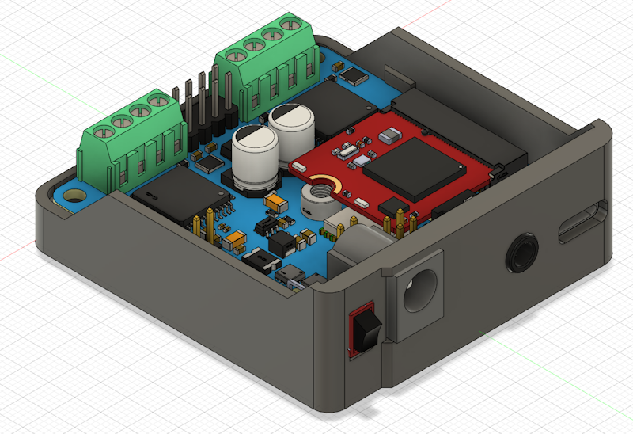
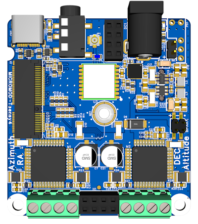
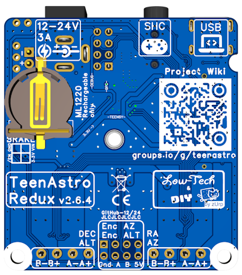
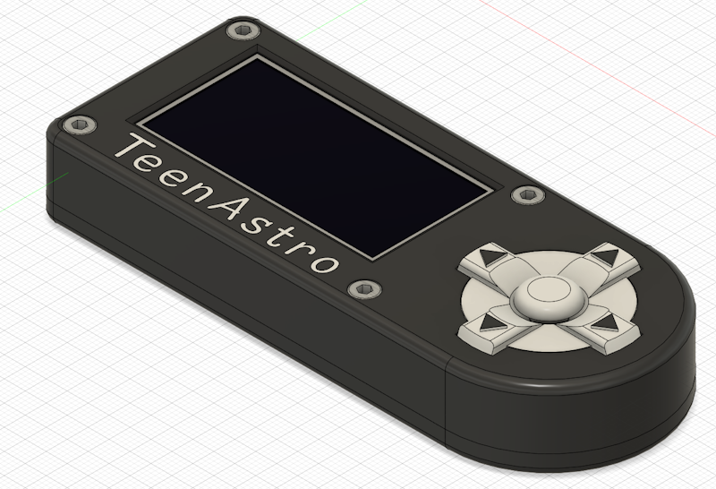
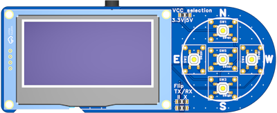
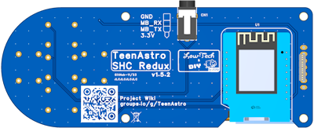
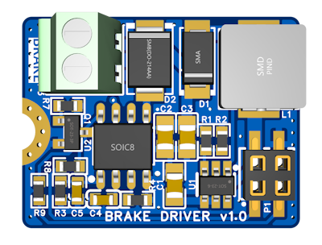
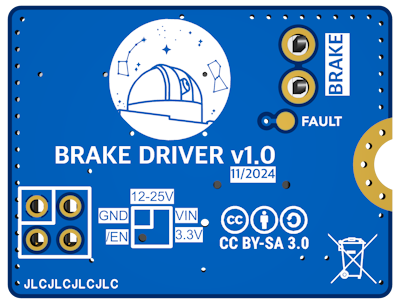

<!-- En-tête vitrine : remplacer ce commentaire par le bloc de
     https://github.com/zUrp-Astronomics/.github/blob/main/readme-kit/repos/<slug>.md
     (affiche + badge de statut, servis par le site). Collé une fois, il se met à jour seul. -->

# Unicorn — Mount Control Station

**Date**: 2026-10-06
**Status**: wip
**Referenced by**: any user of this repository

# ⚠ Work in Progress — NOT VALIDATED — don't build it ⚠

### A small but efficient controller board for astronomical mounts, featuring TeenAstro Redux

Unicorn is the author's own interpretation of TeenAstro. The files keep the names of the parent
project (`TeenAstro_Redux…`); Unicorn is the zUrp name given to this build.

Visit the main project wiki on [groups.io](https://groups.io/g/TeenAstro/wiki).

The firmware is available on the [TeenAstro GitHub](https://github.com/charleslemaire0/TeenAstro) (support in progress).

## Project details

The source project can be found on [OSHWLab](https://oshwlab.com/lordzurp/teenastro-redux).

### Main board: TeenAstro Redux

#### Specs

* 56 × 52 mm form factor, 60 × 56 × 20 mm 3D-printed case
* 12 to 25 V power input, 3 A max
* Power protection (resettable fuse + reverse polarity)
* ESD protection on the USB and SHC ports
* USB-C connector
* Teensy 4.0 MicroMod
* TMC2660 stepper drivers
* Integrated GNSS
* Encoder support
* No ST4 port

#### PCB views

 

### Smart Hand Controller (SHC)

#### Specs

* 125 × 50 × 20 mm 3D-printed case
* ESP8266 (Wemos D1 mini)
* 2.42" OLED display
* Tactile switches with D-pad style buttons
* Selectable 3.3 V or 5 V power input
* Link through a 4-pin 3.5 mm headphone jack
* No focuser control (planned for later)

#### PCB views

 

### Brake module

#### PCB views

 

## Build instructions

### The fancy way: JLCPCB prototyping service

Open the OSHWLab project in the editor, click "Order PCB", wait a week or two, and enjoy!

The BOM is tuned to minimise assembly costs, so some through-hole components are excluded from
factory assembly: you need to order them and solder them yourself. The good news is that you can
customise the connectors or reuse your own component stock ;)

The through-hole parts are listed in the BOM file, with the "Add into BOM" option set to "No".

### The hard way: do it all yourself

All the necessary files are available in `1_Board/`: complete BOM, Gerber files and pick-and-place.
Choose your PCB manufacturer, order the parts yourself, and level up your soldering skills with a
fully hand-assembled board. Be aware that some components are very small or fine-pitch: manual
assembly should be reserved for advanced, skilled users.

### 3D case

3D models are available to print the cases. The source files (Fusion 360 and STEP, in
`2_Hardware/`) let you customise the cases, while the .3MF files (in `3_3D-Models/`) are ready to
slice and print.

## Repository layout

| folder | contents |
|---|---|
| `0_Datasheets/` | component datasheets |
| `1_Board/` | board manufacturing files: schematics, views, Gerber, BoM, PnP; several boards: one subfolder per board |
| `2_Hardware/` | off-board mechanics: enclosure, parts (STEP), mechanical bill of materials |
| `3_3D-Models/` | ready-to-print files (3MF, STL) |
| `4_Firmware/` | firmware: sources, build, tests |
| `5_App/` | PC / phone applications |
| `6_Driver/` | drivers (INDI, ASCOM…) |
| `7_Docs/` | documentation: protocol, design notes |
| `8_References/` | external reference documents |
| `9_Assets/` | images for the README and docs; `zurp.yml` showcase sheet and poster, read by the site |

A folder with no purpose for the project stays absent, or empty with its README.

## License

This project is licensed under the GPL-3.0. See [`LICENSE`](LICENSE).
