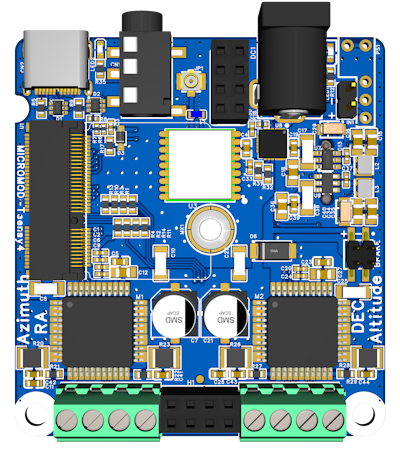
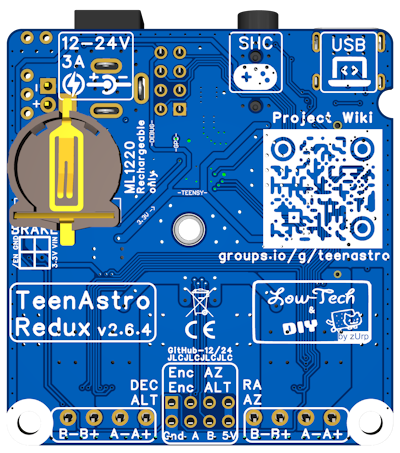

# Unicorn - Control Station

# ⚠Work in Progress -NOT VALIDATED- don't build it⚠

### A small but efficient controller board for astronomic mount, based on great work from Charles Lemaire
 Visit the main WiKi project :  https://groups.io/g/TeenAstro/wiki
 
 
 

## Main Board : TeenAstro Redux

#### Specs

* 56x54mm form factor, 60x58x20 3D printed case
* 12 to 25V power input, 3A max
* Power protection (rearmable fuse + wrong polarity)
* ESD protection on USB and SHC port
* USB-C connector
* Teensy 4.0 Micromod
* TMC2660 stepper drivers
* Integrated GNSS
* encoders support
* no ST4 port

#### PCB views
 

## Smart Hand Controller (SHC)

#### Specs

* 125x50x20mm 3D printed case
* ESP8266 (Wemos D1 mini)
* 2.42" OLED display
* tactiles switchs with D-pad style buttons
* selectable 3.3V or 5V power input
* headphone 3.5mm 4pins link
* no focuser control (planed later)

#### PCB view
 

Firmware : https://github.com/charleslemaire0/TeenAstro (support in progress)
